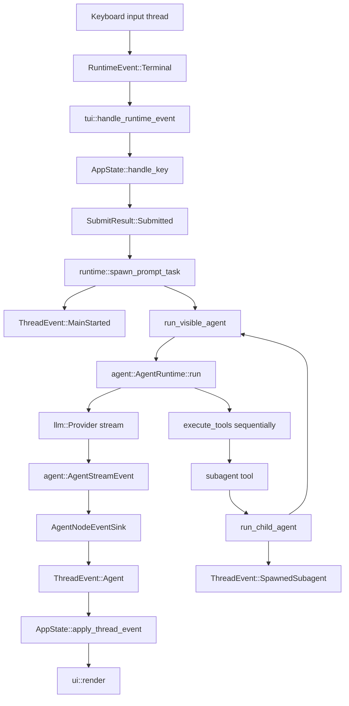

# Agent control flow and abstractions

Temporary notes for understanding the current `cowork` agent flow after the event-model cleanup.

## High-level flow

## Runtime event layers

There are three event layers, each with a narrower responsibility than before.

### 1. `agent::AgentStreamEvent`

Defined in `crates/agent/src/lib.rs`.

This is the generic core-agent stream. It contains only stream/progress/tool events emitted while `AgentRuntime::run` is active:

- provider queue/start notices
- assistant/reasoning deltas
- tool-call start/argument deltas/finished events
- tool results
- token usage

It no longer owns lifecycle (`started`, `finished`, `error`). The caller gets lifecycle from the `Result<String, AgentRunError>` returned by `AgentRuntime::run`.

### 2. `cowork::runtime::AgentNodeEventSink`

Defined in `crates/cowork/src/runtime.rs`.

This adapts one core stream to one visible agent node:

- takes `AgentStreamEvent`
- maps display-relevant events into `AgentNodeEvent`
- wraps them as `ThreadEvent::Agent { addr, event }`
- sends them through the TUI channel

Provider queue/start and incremental tool-call argument events are currently dropped because the UI has no separate representation for them.

### 3. `app::ThreadEvent` and `app::AgentNodeEvent`

Defined in `crates/cowork/src/app.rs`.

`ThreadEvent` is the reducer input for one thread:

- `MainStarted`
- `SpawnedSubagent`
- `Agent { addr, event }`
- `Cancelled`

`AgentNodeEvent` is what can happen to one visible agent node:

- text deltas
- tool call/result updates
- usage
- completion
- error
- retry reset

This keeps thread-wide concerns separate from agent-node concerns. `AppState::apply_thread_event` handles the thread event, and `apply_agent_node_event` resolves the `AgentAddr` exactly once before mutating the target node.

## Top-level prompt flow

1. `tui::handle_runtime_event` receives a key press.
2. `AppState::handle_key` may return `SubmitResult::Submitted`.
3. `runtime::spawn_prompt_task` starts a Tokio task.
4. The task emits `ThreadEvent::MainStarted`.
5. The task builds a `VisibleAgentRun` for `AgentAddr::Main`.
6. It races `run_visible_agent` against the cancellation token.
7. On completion, it emits one terminal thread event:
   - success: `AgentNodeEvent::Finished(AgentCompletion::Done)`
   - failure: `AgentNodeEvent::Error`
   - cancellation: `ThreadEvent::Cancelled`

## `run_visible_agent`

`run_visible_agent` is the shared path for both the main agent and subagents. It owns the common setup:

1. Create an `AgentNodeEventSink` for the target `AgentAddr`.
2. Create a `UiPermissionPolicy` using the sink's thread-level sender.
3. Build an `agent::AgentRuntime` with:
   - Ollama provider
   - shared `ConversationStore`
   - filesystem/PDF tools
   - optional `SubagentTool`
   - preamble and max-turn config
4. Call `run_prompt_with_retries`.

## Retry flow

`run_prompt_with_retries` does two synchronized rewinds on retry:

- model context: `ConversationStore::replace(conversation_id, initial_history)`
- visible transcript: `AgentNodeEvent::Reset`

Only retryable LLM errors use the configured backoff schedule. Deterministic errors, tool setup errors, max-turn errors, and truncation are surfaced immediately. On final failure, the prompt and failure note are appended to model memory so the next user turn has context.

## Subagent flow

A subagent is just another visible agent node driven through `run_visible_agent`.

1. The model calls the `subagent` tool.
2. `SubagentTool::call` parses `SubagentInput` and calls `run_child_agent`.
3. `run_child_agent` generates a random `RuntimeAgentKey` and child `AgentAddr`.
4. It emits `ThreadEvent::SpawnedSubagent` so the reducer creates the node in the sidebar/tree.
5. It builds a child prompt from optional context plus task.
6. It calls `run_visible_agent` with a subagent preamble.
7. If the child is below `MAX_AGENT_DEPTH`, the runtime includes another `SubagentTool`; otherwise it becomes a leaf.
8. On success, the child emits `AgentCompletion::Returned(response)`, which the UI records as a tool-result-style visible message.
9. The `subagent` tool returns the child's response to the parent model as `ToolOutput::text`.

## Reducer responsibilities

`AppState` is still the only mutating UI state owner.

Important reducer methods:

- `apply_thread_event` routes thread-level events.
- `apply_agent_node_event` mutates one resolved agent node.
- `spawn_nested` creates subagent tree nodes.
- `append_delta` coalesces assistant/reasoning stream deltas.
- `apply_tool_result_to_agent` matches tool results back to visible tool-call cards.
- `set_tool_status` updates the most recent matching tool-call card by call id.

`ui.rs` remains read-only: it renders `AppState` and never mutates it.

## Key abstractions

| Abstraction | Location | Purpose |
|---|---|---|
| `llm::Provider` | `crates/llm` | Model backend stream provider. |
| `llm::ConversationMemory` | `crates/llm` | Model-visible conversation state. |
| `agent::AgentRuntime` | `crates/agent` | Generic model/tool loop. |
| `agent::AgentStreamEvent` | `crates/agent` | Core stream/progress/tool events. |
| `agent::ToolPermissionPolicy` | `crates/agent` | Async allow/deny decision before a tool call. |
| `runtime::UiPermissionPolicy` | `crates/cowork` | Applies profile rules and routes ask-mode tools to the TUI. |
| `events::ThreadEventSink` | `crates/cowork` | Sends `ThreadEvent`s into the TUI event channel for one thread. |
| `runtime::AgentNodeEventSink` | `crates/cowork` | Adapts core stream events to one visible agent node. |
| `app::ThreadEvent` | `crates/cowork` | Thread-scoped reducer input. |
| `app::AgentNodeEvent` | `crates/cowork` | Agent-node-scoped reducer input. |
| `app::Message` | `crates/cowork` | Type-safe visible transcript entry. |

## Intentional constraints

- Tool calls remain sequential in `agent::AgentRuntime::execute_tools` because local Ollama is a single-instance backend and nested subagents can themselves issue model requests.
- `ui.rs` must remain read-only.
- `AppState` visible history and `ConversationStore` model memory remain separate stores.
- Top-level lifecycle is owned by `cowork::runtime`, not the generic `agent` crate.
